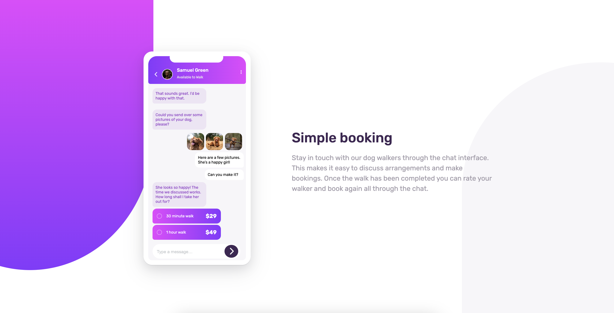
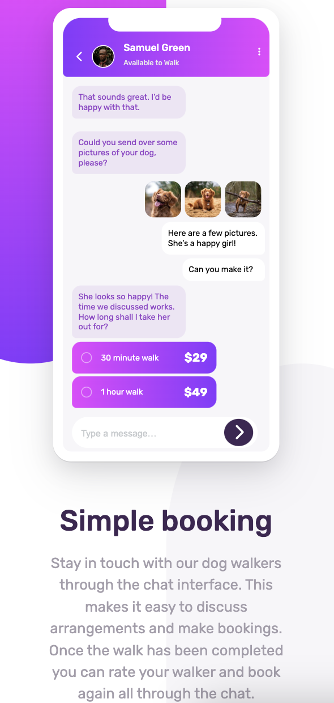

# Frontend Mentor - Chat app CSS illustration solution

This is a solution to the [Chat app CSS illustration challenge on Frontend Mentor](https://www.frontendmentor.io/challenges/chat-app-css-illustration-O5auMkFqY). Frontend Mentor challenges help you improve your coding skills by building realistic projects. 

## Table of contents

- [Overview](#overview)
  - [The challenge](#the-challenge)
  - [Screenshot](#screenshot)
  - [Links](#links)
  - [Built with](#built-with)
  - [Useful resources](#useful-resources)
- [Author](#author)
- [Acknowledgments](#acknowledgments)

**Note: Delete this note and update the table of contents based on what sections you keep.**

## Overview

### The challenge

Users should be able to:

- View the optimal layout for the component depending on their device's screen size
- **Bonus**: See the chat interface animate on the initial load

### Screenshot

### Links

- Solution URL: [github repo](https://github.com/michaelr47/ChatApp-CSS-illustration)
- Live Site URL: [Add live site URL here](https://your-live-site-url.com)

### Built with

- Semantic HTML5 markup
- CSS custom properties
- Flexbox
- Mobile-first workflow

### Useful resources

- [MDN linear gradient](https://developer.mozilla.org/en-US/docs/Web/CSS/gradient/linear-gradient) - This helped me adding the linear gradient colors. I really liked this pattern and will use it going forward.
- [box shadows](https://getcssscan.com/css-box-shadow-examples) - This helped me pick the box shadow for the phone.

## Author

- Frontend Mentor - [@michaelr47](https://www.frontendmentor.io/profile/michaelr47)
